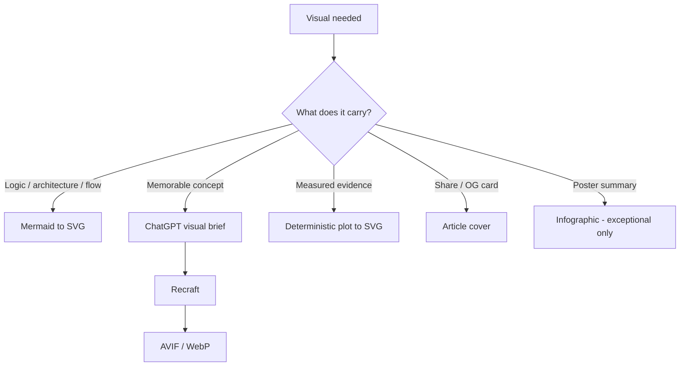

# Visual Guidelines — didac-crst.com

Operational contract for producing and reviewing visuals on this site.
Use this file when an LLM assists with diagrams, illustrations, covers, or visual review.

Full rationale: [`docs/visual-guidelines.md`](docs/visual-guidelines.md)

Writing rules: [`ARTICLE_GUIDELINES.md`](ARTICLE_GUIDELINES.md)

---

## The Zen of Visuals

**Technical diagrams should be engineered. Illustrations should be designed. Infographics should be rare.**

**Quiet technical editorial.**  
Composition and hierarchy over decoration. Teal for machine, champagne for human gates — not neon SaaS diagrams.

**Explain before decorate.**  
**One idea per visual.**  
**Source of truth stays editable.**  
**Machine-readable where possible** (Mermaid → SVG).  
**Semantic classes over decoration.**  
**Prose owns the argument.**  
**If it looks like AI marketing artwork, rewrite the brief.**

---

## Non-negotiables

1. Every visual belongs to one category: **technical diagram**, **conceptual illustration**, **article hero**, **data visualization**, or **article cover** (OG/share).
2. Technical diagrams are **engineered** (Mermaid → SVG). Do **not** generate architecture diagrams with Recraft / image models.
3. Illustrations and heroes start from a **visual brief**, not from "make an image about X."
4. No critical explanation baked into images when HTML can carry it. Heroes may use **2–4 labels** max.
5. Technical SVGs use **CSS tokens** (`currentColor`, `var(--color-*)`) and work in light/dark mode.
6. Colour is never the only carrier of meaning. Diagrams must work in grayscale.
7. Sources stay in `visuals/sources/`. Published files under `visuals/published/` or `public/` are outputs.
8. Semantic filenames: `<article-slug>--<visual-concept>.<ext>`

---

## Decision tree



---

## Dimensions

| Kind | Canvas | Ratio | Format |
| --- | --- | --- | --- |
| Article hero | 1600×900 | 16:9 | AVIF + WebP (+ thin JPEG fallback) |
| Article cover (OG) | 1600×900 (min 1200×675) | 16:9 | AVIF + WebP fallback |
| Technical diagram | 1200×675 | 16:9 | SVG |
| Vertical flow (exception) | 1200×900 | 4:3 | SVG |
| Infographic (rare) | 1200×900 | 4:3 | SVG or AVIF/WebP |
| Data chart | 1200×675 | 16:9 | SVG preferred |
| Conceptual illustration | 1600×900 | 16:9 | AVIF + WebP |

Cover / OG: **no embedded title or explanatory text**.  
Hero: **2–4 labels max**; no article title; no paragraphs.

**Current OG pipeline:** `scripts/generate-og-default.mjs` still emits **1200×630 PNG**. Treat 16:9 AVIF covers as the target; migrate when the cover pipeline is upgraded.

---

## Article hero

**Canonical for flagship Principle articles. Optional for Field Notes.**

Placement (layout chrome, not prose body):

```text
Title
Description / metadata

[ HERO IMAGE ]

Opening story / body
```

Frontmatter:

```yaml
hero:
  src: /images/writing/<slug>--hero.webp
  fallback: /images/writing/<slug>--hero.jpg
  alt: "…"
  width: 1600
  height: 900
```

**Job:** express the article’s **central tension or thesis** in one glance — not a summary of the whole piece.

Good patterns:

- contrast: `A vs B`
- transformation: `before → after`
- boundary: `probabilistic core / deterministic shell`
- visibility: `whole reality / visible subset`
- bottleneck: `cheap generation / expensive verification`

**Rules:**

- 16:9, full article width
- no rounded-card treatment (square corners; thin site border OK)
- no caption by default — the image is the thesis signal
- same visual DNA as diagrams/illustrations (charcoal, teal machine/context, champagne for risk / missing context / human judgment)
- composition may change; palette and restraint stay fixed

**Not the same as OG cover.** OG is for sharing cards. Hero is for on-page reading.

---

## Technical diagram grammar

**Locked.** Prefer composition changes over stylistic restyling per article.

**Signature:** quiet technical editorial — composition and hierarchy first; colour second. No neon, no gradients, no icons by default, normally **no shadow**, no outer panel frame.

**Canonical hierarchy (do not invent new treatments casually):**

```text
plain labels = information states
  → teal framed node = model / machine operation
  → gold boundary + diamond = human judgment (gate)
  → muted thin connectors
  → whitespace
  → captions outside the graphic
```

| Component | Treatment |
| --- | --- |
| Information state / artifact | Text label — **no box** |
| Model operation (extract, reason, …) | Teal accent object |
| Human judgment / gate | Champagne rule + **diamond marker** (canonical) |
| Result state | Plain text |
| Connector | ~1.15 px, muted (~0.7 opacity) |
| Background / outer frame | transparent / **none** |
| Radius | 8 px when a container exists |
| Type | 15 / 500 primary · 12.5 / 400 secondary · avoid 700–800 |
| Colour fill | ≤ ~8–9% accent tint |
| Border | ~1.25 px — accent is an edge, not the object |
| Inline secondary slogans inside the SVG | avoid; put nuance in the caption or prose |
| Compact process cues in prose | HTML `.process-strip` — not a code fence, not a second diagram |

Do not mix states and operations in the same visual treatment. If a label names a transformation performed by a model, it is a teal node — not a plain state.

**Two publication modes:**

| Mode | When | Output |
| --- | --- | --- |
| **Editorial SVG** | Explanatory article figures (few concepts, strong hierarchy) | Hand-composed SVG with `--diagram-*` tokens |
| **Mermaid → SVG** | Architecture, sequences, graphs, ERDs, large flows | Rendered from `.mmd` |

Mermaid remains the **structure source** for both. For editorial figures, Mermaid output is not required to be the published visual.

**Semantic classes:** `neutral` · `machine` · `human` / `gate` · `output`. Dual palette in `diagram-theme.json` + site `--diagram-*` tokens (light/dark).

**Source:** `visuals/sources/_site/diagram-theme.json`. `.mmd` keeps dark classDefs for IDE preview.

**Next work:** composition (what to show, how stages relate), not decoration.

---

## Conceptual illustration style

**Editorial technical abstraction** — restrained, geometric/architectural, large negative space, one metaphor, no cyberpunk / neon / glowing AI brain / robots / stock photo / isometric corporate look.

Feel: scientific editorial × modern software design × architectural visualization.

---

## Density per flagship article

- 1 OG cover
- 0–1 article hero (expected for Principle / flagship)
- 1–3 information diagrams
- 0–1 in-body conceptual illustration
- data charts only when evidence requires them
- infographics: default none

Example for *AI Usually Needs Better Context*:

1. **Hero** — Prompt only vs Prompt + Context
2. **Diagram** — Instruction + Context → Model → Candidate answer
3. **Illustration** — All information → Visible context → Model
4. **Diagram** — Context lifecycle with human gates

---

## Repository layout

```text
visuals/
  sources/<article-slug>/
    <concept>.mmd
    <concept>-brief.md
  published/<article-slug>/
    <concept>.svg | .avif | .webp
```

---

## Pre-publish checklist

- [ ] Explains a real idea; removing it would hurt the article
- [ ] Understandable in ~5 seconds
- [ ] No unnecessary embedded text
- [ ] Follows visual grammar / tokens
- [ ] Source editable a year from now
- [ ] Relationships in the diagram are defensible
- [ ] Light/dark OK (technical)
- [ ] `alt` / `<desc>` + caption when needed
- [ ] Argument still works if images fail to load
- [ ] Flagship Principle: hero present (or consciously skipped)
- [ ] Hero expresses central tension — not a prose summary

---

## Production stack

| Kind | Pipeline |
| --- | --- |
| Technical | Mermaid → SVG |
| Hero / illustration | thesis → brief → Recraft → AVIF/WebP |
| Data | plot tool → SVG |
| Cover (OG) | thesis → brief → Recraft → AVIF/WebP |
