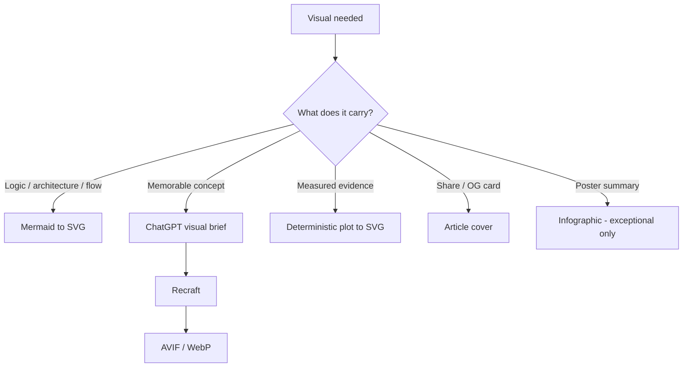
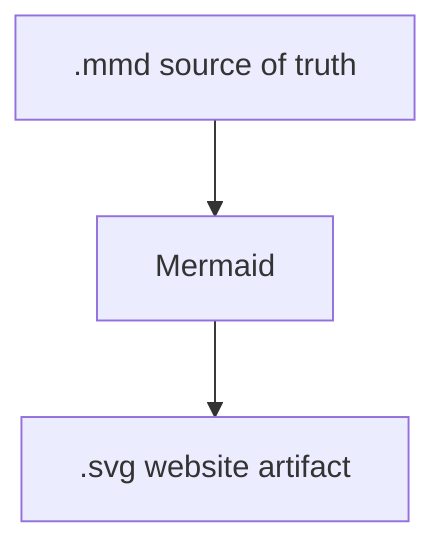
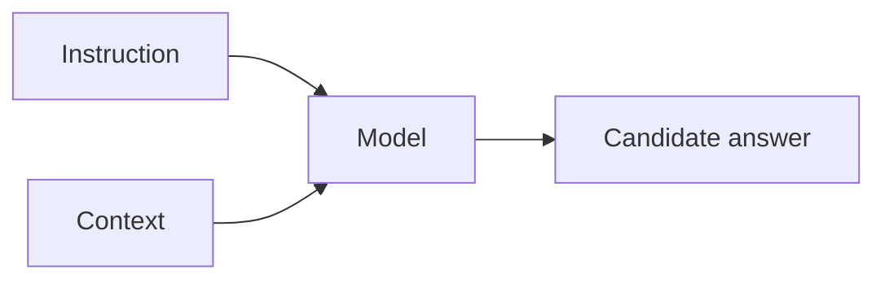

# Visual Guidelines — didac-crst.com

This document defines the visual language for articles and related pages on didac-crst.com.

For a compact operational contract suitable for LLM-assisted production and review, see [`VISUAL_GUIDELINES.md`](../VISUAL_GUIDELINES.md) at the repository root.

Editorial writing rules remain in [`docs/writing-guidelines.md`](writing-guidelines.md). Visuals must obey those rules — especially: diagrams explain rather than decorate, and important explanatory text stays outside images whenever possible.

---

## The Zen of Visuals

**Technical diagrams should be engineered. Illustrations should be designed. Infographics should be rare.**

**Quiet technical editorial.**  
Dark neutral surfaces, thin borders, type hierarchy, teal for machine, champagne for human — not neon SaaS diagrams.

**Explain before decorate.**  
A visual exists to make an idea easier to understand, remember, or navigate.

**One idea per visual.**  
Prefer one strong diagram over six average images.

**Source of truth stays editable.**  
Published assets are outputs. Mermaid, prompts, and SVG sources remain in the repository.

**Machine-readable where possible.**  
Prefer Mermaid → SVG over hand-positioned coordinates when the diagram is structural.

Shared theme snippet: [`visuals/sources/_site/diagram-theme.json`](../visuals/sources/_site/diagram-theme.json).

Apply theme at SVG render time. Do **not** embed multi-line `%%{init}%%` in `.mmd` sources — IDE Mermaid previews will show “Unable to render.”

Validate with `npm run check:mermaid` (parse + preview lint).

**Semantic classes over decoration.**  
Colour encodes machine vs human vs data. Labels must still work in grayscale.

**Prose owns the argument.**  
A reader should still understand the central idea if images fail to load.

**If it looks like AI marketing artwork, rewrite the brief.**

---

## 1. Principle

Visuals exist to make an idea easier to **understand, remember, or navigate**.

They are not inserted to break up text.

Every visual must belong to one of four categories:

1. **Technical diagram**
2. **Conceptual illustration**
3. **Data visualization**
4. **Article cover**

Infographics are an exceptional combination of the above — not a default category.

---

## 2. Decision tree



Source: [`visuals/sources/_site/visual-decision-tree.mmd`](../visuals/sources/_site/visual-decision-tree.mmd)

| Question | Prefer |
| --- | --- |
| Does it carry relationships, flow, or architecture? | Technical diagram (Mermaid → SVG) |
| Does it make an abstract idea memorable? | Conceptual illustration (brief → Recraft) |
| Does it present measured evidence? | Data visualization (deterministic plot → SVG) |
| Is it for cards, sharing, or OG preview? | Article cover |
| Would several facts become clearer as one poster? | Infographic only if exceptional |

**Do not use Recraft to generate architecture diagrams.** You lose deterministic geometry, editability, Git diffs, accessibility, text consistency, and reproducibility.

---

## 3. Canonical dimensions

### Article cover

**Purpose:** article card, social preview, OG image, visual identity.

| Spec | Value |
| --- | --- |
| Aspect ratio | **16:9** |
| Master size | **1600 × 900 px** |
| Minimum export | **1200 × 675 px** |
| Format | **AVIF** (master), **WebP** fallback |
| Text inside image | **none** |
| Safe zone | important content inside the central **80%** |
| Idea count | one dominant visual idea only |

The article title remains HTML. Do not bake the title into the cover image.

**Current implementation note:** the site currently generates OG images at **1200 × 630 PNG** via `scripts/generate-og-default.mjs` (common social-card ratio). Treat 16:9 AVIF/WebP as the **target** for dedicated article covers; migrate when the cover pipeline is upgraded. Until then, auto-generated OG cards remain acceptable for sharing.

### Technical diagram

| Spec | Value |
| --- | --- |
| Canonical canvas | **1200 × 675** |
| Aspect ratio | **16:9** |
| Publication format | **SVG** |
| Source | **Mermaid whenever practical** |
| Alternatives | hand-written SVG or Excalidraw |
| Rasterization | **never**, unless an external platform requires it |
| Background | transparent |
| Max conceptual depth | approximately **7–9** primary elements |
| Article display width | must remain legible at ~**760 px** |

For unusually vertical flows, a secondary canvas is allowed:

| Spec | Value |
| --- | --- |
| Canvas | **1200 × 900** |
| Aspect ratio | **4:3** |

Do not invent arbitrary canvas ratios for individual diagrams.

**Excalidraw** is allowed only when free spatial composition materially improves communication (e.g. a conceptual spatial layout where Mermaid becomes awkward). Mermaid remains the default for formal graphs, flows, and sequences.

### Infographic (exceptional)

| Spec | Value |
| --- | --- |
| Canvas | **1200 × 900** |
| Aspect ratio | **4:3** |
| Format | SVG when primarily structural; AVIF/WebP when primarily illustrative |
| Max sections | **4** |
| Embedded text | minimal |
| Detailed explanation | remains HTML |

Avoid tall Pinterest-style infographics.

### Data visualization

| Spec | Value |
| --- | --- |
| Default canvas | **1200 × 675** |
| Aspect ratio | **16:9** |
| Format | preferably SVG |

---

## 4. Diagram visual grammar

**Canonical hierarchy (locked — compose, don’t restyle):**

```text
plain labels = information states
  → teal framed node = model / machine operation
  → gold boundary + diamond = human judgment (gate)
  → muted thin connectors
  → whitespace
  → captions outside the graphic
```

Do not mix states and operations in the same visual treatment.

No icons by default. No gradients inside technical diagrams. No neon. No illustration inside technical diagrams. No outer panel frame.

**Editorial figures vs engineering graphs:** short explanatory figures in articles may be hand-composed SVG (labels without boxes; gates as boundaries). Mermaid remains the structure source and the default pipeline for architecture, sequences, and large flows.

Recraft illustrations may carry richer atmosphere. Technical diagrams stay engineered and quiet.

That rhythm on the page:

```text
[optional hero] → prose → clean engineering diagram → prose → conceptual illustration → prose
```

**Article heroes** sit in layout chrome (below title/metadata, before the opening story). They express the central tension in one glance. Flagship Principle pieces should usually have one; Field Notes may skip. See the compact contract [`VISUAL_GUIDELINES.md`](../VISUAL_GUIDELINES.md) § Article hero.

### Shapes

Use a small, stable vocabulary:

| Shape | Mermaid | Use |
| --- | --- | --- |
| Soft rounded node | `(["Label"])` | default process / entity (preferred) |
| Rectangle | `["Label"]` | external input / output where useful |
| Soft rounded + label | `(["Human gate…"])` | human decision / review |
| Document symbol | — | only when semantically useful |
| Cylinder | — | only for actual persistent storage |
| Solid arrow | `-->` | direction or dependency |
| Dashed arrow | `-.->` | optional, inferred, or asynchronous |

Prefer stadium / soft rounded nodes `(["…"])` over sharp boxes `["…"]`. Softer geometry; not bubbly.

Do not use decorative icons where a labelled shape is clearer.

### Geometry

| Token | Specification |
| --- | --- |
| Corner radius | **10 px** |
| Node border | **1.5 px** |
| Main arrow | **1.5–2 px** |
| Internal horizontal padding | **18–22 px** |
| Internal vertical padding | **14–18 px** |
| Node gap | **40–56 px** |
| Rank / section spacing | **56–72 px** |
| Diagram background | transparent |
| Shadow | very subtle, optional — applied **after** Mermaid render |
| Glow | **no** (except perhaps extremely subtle accent halo in conceptual illustrations) |

Prefer alignment to visual improvisation. Elements should sit on an implicit grid.

Whitespace matters more than shadow. Diagrams should read as nodes with breathing room, not dense flowcharts.

### Typography

Diagram text uses the site sans stack (`Inter, ui-sans-serif, system-ui, …`).

| Role | Size / weight / colour |
| --- | --- |
| Primary node label | **15–16 px / 600** / text |
| Secondary line | **12–13 px / 400** / muted text |
| Annotation | **12 px / 400** / muted text |

Hierarchy is mandatory. Primary and secondary lines must not look equal:

```text
Human promotion gate          15px / 600 / text
correct? complete? …          12px / 400 / muted
```

- No text smaller than **12 px** in the SVG coordinate system
- Sentence case
- No paragraphs inside diagrams
- Use `<br/><small>…</small>` (or equivalent) for secondary lines in Mermaid

### Semantic classes

Colour encodes argument, not decoration. Reuse these roles across articles:

| Role | Meaning | Treatment |
| --- | --- | --- |
| `neutral` | data, infrastructure, raw material | dark surface + thin neutral border |
| `machine` | probabilistic / AI / system reasoning | teal accent stroke + lightly tinted fill |
| `human` | judgment, review, quality gates | warm champagne accent stroke + lightly tinted fill |
| `output` | candidate / result | neutral surface + slightly stronger border |

Readers should eventually learn:

- **teal** = machine / probabilistic
- **champagne** = human judgment
- **neutral** = data / infrastructure

Prefer a **3 px accent edge or tiny accent dot** plus lightly tinted background over painting the whole node teal or gold. Keep surfaces quiet.

Labels must still make sense in grayscale. Colour reinforces; it never carries meaning alone.

### Effects ranking

| Technique | Use |
| --- | ---: |
| Rounded corners | ⭐⭐⭐⭐⭐ |
| Typography hierarchy | ⭐⭐⭐⭐⭐ |
| Semantic colour | ⭐⭐⭐⭐⭐ |
| Whitespace | ⭐⭐⭐⭐⭐ |
| Thin border | ⭐⭐⭐⭐⭐ |
| Subtle shadow | ⭐⭐⭐ |
| Gradient | ⭐ |
| Glow | ⭐ |
| Glassmorphism | ❌ |

Subtle shadow example (post-render CSS, not baked into every `.mmd`):

```css
filter: drop-shadow(0 4px 10px rgb(0 0 0 / 0.16));
```

### Separation of concerns

Mermaid sources stay conceptually simple:

```text
node → node → node
semantic classes (neutral / machine / human / output)
```

The website renderer (or post-process CSS) owns:

```text
font · radius · shadow · palette · spacing
```

Do not push polish effects into every `.mmd` file.

---

## 5. Colour

### Canonical diagram tokens

Technical diagrams use a dedicated quiet-editorial dual palette, aligned with brand cyan and warm beige.

Source of truth: [`visuals/sources/_site/diagram-theme.json`](../visuals/sources/_site/diagram-theme.json) (`modes.dark` / `modes.light`).

Published SVGs on the site use CSS variables that switch with the page theme:

```text
--diagram-surface
--diagram-border
--diagram-text
--diagram-muted
--diagram-arrow
--diagram-machine / --diagram-machine-fill
--diagram-human / --diagram-human-fill
--diagram-output-border
```

| Role | Dark | Light |
| --- | --- | --- |
| Surface | `#11171D` | `#FFFFFF` |
| Border | `#2B3742` | `#D8D4CA` |
| Text | `#E9F0F5` | `#171717` |
| Muted text | `#91A1AE` | `#61615B` |
| Arrow | `#667783` | `#8A8580` |
| Machine accent | `#55C7C2` | `#176F67` |
| Human accent | `#D9B76E` | `#80684C` |

Semantic roles stay stable across modes:

- **teal / cyan** = machine / probabilistic
- **champagne / warm** = human judgment
- **neutral** = data / infrastructure

Maximum filled accent colours: **2** (machine + human), and only when the distinction carries meaning.

Colour must never be the only mechanism communicating meaning. Labels must remain understandable in grayscale.

---

## 6. Light and dark mode

**Do not fork `.mmd` files into light/dark copies.**

```text
.mmd source          → dark palette (stable IDE preview)
        ↓ render
published SVG        → CSS variables / dual theme JSON
        ↓ page theme
light or dark automatically
```

| Layer | Mode behaviour |
| --- | --- |
| Mermaid `.mmd` | Always use **dark** `classDef` values for preview stability |
| `diagram-theme.json` | Holds both `modes.dark` and `modes.light` |
| Site tokens (`tokens.css`) | Defines `--diagram-*` for light and dark |
| Inline / published SVG | Prefer `var(--diagram-*)` so theme toggle switches colours |

Resolve a mode in scripts via `scripts/lib/diagram-theme.mjs`:

```js
import { getDiagramMode } from "./lib/diagram-theme.mjs";
const dark = await getDiagramMode("dark");
const light = await getDiagramMode("light");
```

Never maintain two fully separate hand-drawn diagram versions unless technically unavoidable.

---

## 7. Conceptual illustrations

**Purpose:** make an abstract argument memorable.

Examples: context gap, workbench vs assembly line, deterministic skeleton, information bottleneck, aerodynamic drag.

These are illustrations, not diagrams.

| Spec | Value |
| --- | --- |
| Size | **1600 × 900** |
| Aspect ratio | **16:9** |
| Format | AVIF master, WebP fallback |
| Embedded explanatory text | **none** |
| Title inside image | **none** |

### Style: editorial technical abstraction

Characteristics:

- dark or neutral environment
- restrained composition
- large negative space
- geometric or architectural forms
- subtle depth
- realistic materials only when useful
- one visual metaphor
- minimal visual noise
- sophisticated rather than futuristic

Avoid:

- cyberpunk
- neon overload
- generic glowing AI brain
- humanoid robot imagery
- stock-photo aesthetic
- corporate isometric infographic aesthetic

Target feel:

> scientific editorial illustration × modern software design × architectural visualization

Not:

> AI marketing artwork

---

## 8. AI illustration workflow

### Stage 1 — Visual reasoning (ChatGPT / Cursor)

Define before generating:

- what idea the illustration represents
- the metaphor
- composition
- subject hierarchy
- what must not appear
- relation to the article thesis

Do not start with "make an image about AI context."

First define the visual model.

### Stage 2 — Production (Recraft)

Generate and refine according to the canonical style.

The prompt should explicitly describe:

- editorial technical illustration
- composition and geometry
- visual metaphor
- negative space
- restrained palette
- absence of embedded typography
- absence of generic AI imagery

Several candidates may be generated. **Selection remains a human editorial decision.**

Recraft is the **visual renderer**, not the visual thinker.

Example brief pattern for *The Context Gap*:

> A small illuminated working area surrounded by a much larger technical system hidden in darkness. The AI has access only to the illuminated fragment; additional context progressively reveals the surrounding architecture.

That starts from the **idea**. Generic image prompts start from generation — which contradicts the thesis of the writing itself.

---

## 9. Infographics

Infographics are **exceptional**.

Use one only when several related facts genuinely become easier to understand as one visual composition.

Do not create an infographic merely to summarize an article.

Prefer:

```text
diagram + prose
```

over:

```text
large poster containing the prose again
```

---

## 10. Data visualizations

Charts are evidence, not decoration.

Rules:

- show units
- label axes
- state data source
- distinguish measured and illustrative data
- remove unnecessary chart furniture
- avoid 3D charts
- avoid pie charts unless part-to-whole is genuinely clearer
- avoid decorative gradients
- use direct labels where practical
- preserve numerical integrity

Chart style uses the same typography and design tokens as technical diagrams.

---

## 11. Visual density

A typical flagship article should contain approximately:

| Type | Count |
| --- | ---: |
| Article cover | **1** |
| Information diagrams | **1–3** |
| Conceptual illustration | **0–1** |
| Data visualizations | only when evidence requires them |
| Infographics | **0** by default |

There is no quota.

An article with one excellent diagram is preferable to an article with six average visuals.

### Example: *AI Usually Needs Better Context*

| Visual | Need | Purpose |
| --- | --- | --- |
| Article cover / OG | ✅ | Recognition, share preview |
| Technical diagram #1 | ✅ | Instruction vs context |
| Technical diagram #2 | ✅ | Trusted-context lifecycle |
| Conceptual illustration | Optional | Make the context gap memorable |
| Infographic | ❌ | No real need |
| Stock / photo imagery | ❌ | Weakens engineering identity |

Target: **about 3 visuals**, not 7.

---

## 12. Accessibility

Every meaningful visual must have:

- descriptive `alt` text or SVG `<title>` / `<desc>`
- a caption when interpretation is not obvious
- adequate contrast
- no critical information communicated only by colour

Important information must remain available in HTML prose.

A reader should still understand the central argument if images fail to load.

---

## 13. File naming

Use semantic filenames.

Pattern:

```text
<article-slug>--<visual-concept>.<ext>
```

Examples:

```text
ai-needs-better-context--instruction-context-model.svg
ai-needs-better-context--context-lifecycle.svg
ai-needs-better-context--context-gap.avif
```

Avoid:

```text
diagram1.svg
final-image-v3.avif
recraft-export-29483.webp
```

---

## 14. Repository structure

```text
visuals/
  sources/
    <article-slug>/
      <concept>.mmd              # Mermaid source of truth
      <concept>-brief.md         # illustration brief / Recraft prompt notes
      <concept>.excalidraw       # only when Mermaid is awkward
  published/
    <article-slug>/
      <concept>.svg              # website artifact
      <concept>.avif             # illustration / cover
      <concept>.webp             # fallback
```

Published site assets may also live under `public/` when required by the build (for example `public/og/writing/`). In that case, keep the editable source under `visuals/sources/` and treat `public/` as a deploy output.

The published asset is an **output**. The source of truth remains editable.

---

## 15. Canonical production stack

| Kind | Pipeline |
| --- | --- |
| Technical information | Markdown / Mermaid → SVG → website |
| Conceptual illustration | Article thesis → ChatGPT visual brief → Recraft → AVIF/WebP |
| Data | Data → deterministic plotting tool → SVG |
| Article cover | Article thesis → ChatGPT visual concept → Recraft → AVIF/WebP |

The site may contain visuals produced through different tools while sharing one visual language.

### Why Mermaid over hand-written SVG

Hand-written SVG with explicit coordinates is conceptually sound for simple diagrams, but it becomes maintenance debt.

Prefer:



Then agents and humans edit the diagram semantically:



instead of manipulating path coordinates. That aligns with the site's broader idea: information that humans and machines can both reason over.

---

## 16. Visual quality gate

Before publishing a visual, ask:

- [ ] Does it explain or reinforce a meaningful idea?
- [ ] Would removing it make the article worse?
- [ ] Is it understandable in less than approximately five seconds?
- [ ] Does it contain unnecessary text?
- [ ] Is the information already explained better by HTML?
- [ ] Does it follow the site's visual grammar?
- [ ] Could it belong to another article on didac-crst.com without looking stylistically foreign?
- [ ] Will the source remain editable one year from now?
- [ ] Can I defend every relationship represented in the diagram?
- [ ] Does it work in light and dark mode (technical diagrams)?
- [ ] Is accessibility covered (`alt` / `<desc>`, caption, contrast)?

If not, revise or remove it.

---

## 17. Long-term goal

Someone should eventually be able to recognize one of these diagrams or illustrations **before seeing the domain name**.

That consistency is the point of defining the visual language before articles accumulate five different styles.

---

## Related files

- [`VISUAL_GUIDELINES.md`](../VISUAL_GUIDELINES.md) — compact operational contract
- [`docs/writing-guidelines.md`](writing-guidelines.md) — editorial writing standard
- [`ARTICLE_GUIDELINES.md`](../ARTICLE_GUIDELINES.md) — writing operational contract
- [`src/styles/tokens.css`](../src/styles/tokens.css) — design tokens
- [`visuals/`](../visuals/) — editable visual sources and published artifacts
